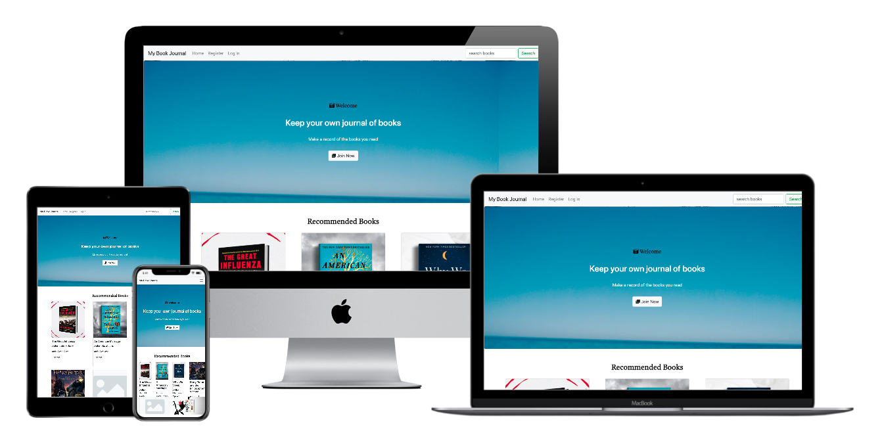

<h1 align="center">MS3 MY BOOK JOURNAL</h1>

[View the live project here.](https://ms3-my-book-journal.herokuapp.com/)

This is my MS3 project mainly built to deepen and demonstrate my skills in Python and MongoDB etc. The original user stories are not yet fulfilled with a tight constraint of time. Yet it could be developed into a handy app in the future to work as a personal e-journal to organise books into different lists.

Currently new users can register and login their account to add/edit/delete a book, and to add a new list name. However, only admin users can edit or delete a list name, and this edit/delete functionality has not yet been developed fully, hence still under construction.

<h2 align="center"></h2>

## User Experience (UX)

-   ### User stories

    -   #### User Goals

        1. As a user, I want to easily understand how to use this book journal website.
        2. As a user, I want to be able to easily navigate throughout the site to realise different functionalities.
        3. As a user, I want to easily understand how to use this website to add books into different lists to organise my interested books.
        4. As a user, I want to be able to search for a book.
        5. As a user, I want to be able to browse existing books.

*   ### Wireframes

    -   Home Page Wireframe - [View](static/images/homepage.png)

    -   Book details page Wireframe - [View](static/images/book-details.png)

## Features

-   Responsive on all device sizes

-   Interactive elements

## Technologies Used

### Languages Used

-   [HTML5](https://en.wikipedia.org/wiki/HTML5)
-   [CSS3](https://en.wikipedia.org/wiki/Cascading_Style_Sheets)
-   [JavaScript]
-   [Python]

### Frameworks, Libraries & Programs Used

1. [MongoDB:](https://www.mongodb.com/)
    - MongoDB was used to store and manipulate data.

1. [Bootstrap 4.4.1:](https://getbootstrap.com/docs/4.4/getting-started/introduction/)
    - Bootstrap was used to assist with the responsiveness and styling of the website.
1. [Hover.css:](https://ianlunn.github.io/Hover/)
    - Hover.css was used on the Social Media icons in the footer to add the float transition while being hovered over.
1. [Google Fonts:](https://fonts.google.com/)
    - Google fonts were used to import the 'Titillium Web' font into the style.css file which is used on all pages throughout the project.
1. [Font Awesome:](https://fontawesome.com/)
    - Font Awesome was used on all pages throughout the website to add icons for aesthetic and UX purposes.
1. [jQuery:](https://jquery.com/)
    - jQuery came with Bootstrap to make the navbar responsive but was also used for the smooth scroll function in JavaScript.
1. [Git](https://git-scm.com/)
    - Git was used for version control by utilizing the Gitpod terminal to commit to Git and Push to GitHub.
1. [GitHub:](https://github.com/)
    - GitHub is used to store the projects code after being pushed from Git.
1. [Balsamiq:](https://balsamiq.com/)
    - Balsamiq was used to create the [wireframes] during the design process.

## Testing

The W3C Markup Validator and W3C CSS Validator Services were used to validate every page of the project to ensure there were no syntax errors in the project.

-   [W3C Markup Validator](https://jigsaw.w3.org/css-validator/#validate_by_input) 
-   [W3C CSS Validator](https://jigsaw.w3.org/css-validator/#validate_by_input) 

### Testing User Stories from User Experience (UX) Section

-   #### Users Goals

        1. Upon entering the site, users will see the welcome message on jumbotron and below the current books.
        2. After successful registration the user will be able to start adding/editing books and lists.
        

### Further Testing

-   The Website was tested on Google Chrome, Microsoft Edge and Safari browsers.
-   The website was viewed on a variety of devices such as Desktop, Laptop, iPhone7, iPhone 8 & iPhoneX.

### For further improvements

-   Some functionalities are not yet displayed, e.g. edit/delete lists, because they're still exclusive to the admin user only; however, in the future these functionalities should be open to every user for them to manage their own lists conveniently.
-   Flash messages need further styling, possibly using Bootstrap toasts.
-   Currently users do not receive comfirmation message before deleting a book/list, however, it should be added for essential protection.

## Deployment

### This project has been deployed through Heroku.

## Credits

### Code

-  The jumbotron on homepage is from [MDB](https://mdbootstrap.com/docs/jquery/components/jumbotron/)

-  card deck styling is inspired by [Julia](https://codepen.io/julice/pen/RvdVbV)

-   [Bootstrap4](https://getbootstrap.com/docs/4.4/getting-started/introduction/): Bootstrap Library used throughout the project mainly to make site responsive using the Bootstrap Grid System.

### Content

-   Book properties in Bill Gates' list are all from [GatesNotes](https://www.gatesnotes.com)

-   Other books properties are from [Amazon](https://www.amazon.co.uk) 

-   README.md modified from Code Institute [sample](https://github.com/Code-Institute-Solutions/SampleREADME/blob/master/README.md)

### Media

-   image for jumbotron is from [Unsplash](https://unsplash.com/photos/s-ImNJWdHrI)

### Acknowledgements

-   Tutor support at Code Institute for their support.